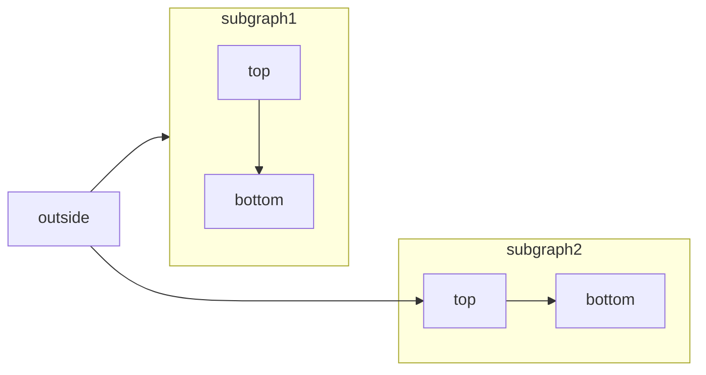
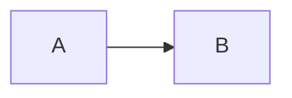

[Skip to main content](#content-area)

[Mintlify home page](https://mintlify.com/docs)

[Documentation](https://www.mintlify.com/docs)[Guides](https://www.mintlify.com/docs/guides)[API reference](https://www.mintlify.com/docs/api/introduction)[Changelog](https://www.mintlify.com/docs/changelog)

Search...

Navigation

Components

Mermaid

Search...

⌘K

##### Get started

- [Introduction](https://www.mintlify.com/docs)
- [Quickstart](https://www.mintlify.com/docs/quickstart)
- [AI-native](https://www.mintlify.com/docs/ai-native)
- [Migration guide](https://www.mintlify.com/docs/migration)

##### Organize

- [Global settings](https://www.mintlify.com/docs/organize/settings)
- [Navigation](https://www.mintlify.com/docs/organize/navigation)
- [Pages](https://www.mintlify.com/docs/organize/pages)
- [Hidden pages](https://www.mintlify.com/docs/organize/hidden-pages)
- [Exclude files](https://www.mintlify.com/docs/organize/mintignore)

##### Customize

- [Custom domain](https://www.mintlify.com/docs/customize/custom-domain)
- [Themes](https://www.mintlify.com/docs/customize/themes)
- [Fonts](https://www.mintlify.com/docs/customize/fonts)
- [Custom scripts](https://www.mintlify.com/docs/customize/custom-scripts)
- [React](https://www.mintlify.com/docs/customize/react-components)
- [Custom 404 page](https://www.mintlify.com/docs/customize/custom-404-page)

##### Create content

- Web editor

- [Install the CLI](https://www.mintlify.com/docs/installation)
- [Format text](https://www.mintlify.com/docs/create/text)
- [Format code](https://www.mintlify.com/docs/create/code)
- Agent

- Components

    -   [Overview](https://www.mintlify.com/docs/components)
    -   [Accordions](https://www.mintlify.com/docs/components/accordions)
    -   [Badge](https://www.mintlify.com/docs/components/badge)
    -   [Banner](https://www.mintlify.com/docs/components/banner)
    -   [Callouts](https://www.mintlify.com/docs/components/callouts)
    -   [Cards](https://www.mintlify.com/docs/components/cards)
    -   [Code groups](https://www.mintlify.com/docs/components/code-groups)
    -   [Color](https://www.mintlify.com/docs/components/color)
    -   [Columns](https://www.mintlify.com/docs/components/columns)
    -   [Examples](https://www.mintlify.com/docs/components/examples)
    -   [Expandables](https://www.mintlify.com/docs/components/expandables)
    -   [Fields](https://www.mintlify.com/docs/components/fields)
    -   [Frames](https://www.mintlify.com/docs/components/frames)
    -   [Icons](https://www.mintlify.com/docs/components/icons)
    -   [Mermaid](https://www.mintlify.com/docs/components/mermaid-diagrams)
    -   [Panel](https://www.mintlify.com/docs/components/panel)
    -   [Prompt](https://www.mintlify.com/docs/components/prompt)
    -   [Response fields](https://www.mintlify.com/docs/components/responses)
    -   [Steps](https://www.mintlify.com/docs/components/steps)
    -   [Tabs](https://www.mintlify.com/docs/components/tabs)
    -   [Tiles](https://www.mintlify.com/docs/components/tiles)
    -   [Tooltips](https://www.mintlify.com/docs/components/tooltips)
    -   [Tree](https://www.mintlify.com/docs/components/tree)
    -   [Update](https://www.mintlify.com/docs/components/update)
    -   [View](https://www.mintlify.com/docs/components/view)
- [Images and embeds](https://www.mintlify.com/docs/create/image-embeds)
- [Files](https://www.mintlify.com/docs/create/files)
- [Lists and tables](https://www.mintlify.com/docs/create/list-table)
- [Reusable snippets](https://www.mintlify.com/docs/create/reusable-snippets)
- [Personalized content](https://www.mintlify.com/docs/create/personalization)
- [Redirects](https://www.mintlify.com/docs/create/redirects)
- [Changelogs](https://www.mintlify.com/docs/create/changelogs)

##### Document APIs

- [Playground](https://www.mintlify.com/docs/api-playground/overview)
- [OpenAPI setup](https://www.mintlify.com/docs/api-playground/openapi-setup)
- [Complex data types](https://www.mintlify.com/docs/api-playground/complex-data-types)
- [Add SDK examples](https://www.mintlify.com/docs/api-playground/adding-sdk-examples)
- [Manage page visibility](https://www.mintlify.com/docs/api-playground/managing-page-visibility)
- [Multiple responses](https://www.mintlify.com/docs/api-playground/multiple-responses)
- [Create manual API pages](https://www.mintlify.com/docs/api-playground/mdx-setup)
- [AsyncAPI setup](https://www.mintlify.com/docs/api-playground/asyncapi-setup)
- [Troubleshooting](https://www.mintlify.com/docs/api-playground/troubleshooting)

##### Deploy

- [Deployments](https://www.mintlify.com/docs/deploy/deployments)
- [Preview deployments](https://www.mintlify.com/docs/deploy/preview-deployments)
- /docs subpath

- [Authentication setup](https://www.mintlify.com/docs/deploy/authentication-setup)
- Dashboard access

- [Monorepo setup](https://www.mintlify.com/docs/deploy/monorepo)
- [External proxies with Vercel](https://www.mintlify.com/docs/deploy/vercel-external-proxies)
- [CI checks](https://www.mintlify.com/docs/deploy/ci)
- [GitHub](https://www.mintlify.com/docs/deploy/github)
- [GitHub Enterprise Server](https://www.mintlify.com/docs/deploy/ghes)
- [GitLab](https://www.mintlify.com/docs/deploy/gitlab)

##### Optimize

- [Assistant](https://www.mintlify.com/docs/ai/assistant)
- [Discord bot](https://www.mintlify.com/docs/ai/discord)
- [Slack bot](https://www.mintlify.com/docs/ai/slack-bot)
- [Contextual menu](https://www.mintlify.com/docs/ai/contextual-menu)
- [Analytics](https://www.mintlify.com/docs/optimize/analytics)
- [Feedback](https://www.mintlify.com/docs/optimize/feedback)
- [llms.txt](https://www.mintlify.com/docs/ai/llmstxt)
- [skill.md](https://www.mintlify.com/docs/ai/skillmd)
- [Model Context Protocol](https://www.mintlify.com/docs/ai/model-context-protocol)
- [SEO](https://www.mintlify.com/docs/optimize/seo)
- [Markdown export](https://www.mintlify.com/docs/ai/markdown-export)
- [PDF exports](https://www.mintlify.com/docs/optimize/pdf-exports)
- Integrations


English

[Mermaid](https://mermaid.js.org/) lets you build flowcharts, sequence diagrams, Gantt charts, and other diagrams using text and code. For a complete list of supported diagram types and syntax, see the [Mermaid documentation](https://mermaid.js.org/intro/).

subgraph2

subgraph1

top

bottom

top

bottom

outside

Mermaid flowchart example
````

````

##

[​](#interactive-controls)

Interactive controls

All Mermaid diagrams include interactive zoom and pan controls. By default, controls appear when the diagram height exceeds 120px.

- **Zoom in/out**: Use the zoom buttons to increase or decrease the diagram scale.
- **Pan**: Use the directional arrows to move around the diagram.
- **Reset view**: Click the reset button to return to the original view.

The controls are especially useful for large or complex diagrams that don’t fit entirely in the viewport.

##

[​](#properties)

Properties

[​](#param-actions)

actions

boolean

Show or hide the interactive controls. When set, this overrides the default behavior (controls shown when diagram height exceeds 120px).

[​](#param-placement)

placement

string

default:"bottom-right"

Position of the interactive controls. Options: `top-left`, `top-right`, `bottom-left`, `bottom-right`.

###

[​](#examples)

Examples

Hide controls on a diagram:
````

````
Show controls in the top-left corner:
````

````
Combine both properties:
````

````

##

[​](#syntax)

Syntax

To create a Mermaid diagram, write your diagram definition inside a Mermaid code block.
````
```mermaid
// Your mermaid diagram code here
```
````
Was this page helpful?

YesNo

[IconsPrevious](https://www.mintlify.com/docs/components/icons)[PanelNext](https://www.mintlify.com/docs/components/panel)

⌘I
